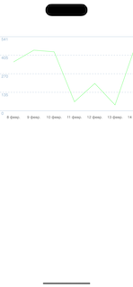
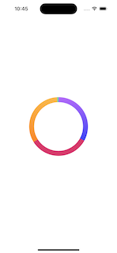
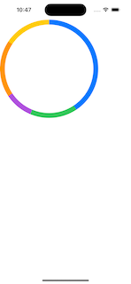
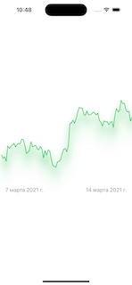

# ExampleLineAndPieCharts

This is a small comparison of the implementation of elements on uikit and swiftui, the implementation is approximate.

## Screenshots

### Screenshot Line chart UIKit

### Screenshot Pie chart UIKit

### Screenshot Pie chart SwiftUI

### Screenshot Line chart SwiftUI

